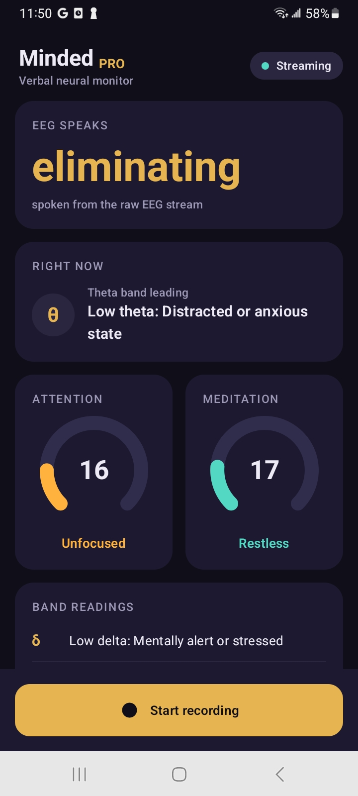
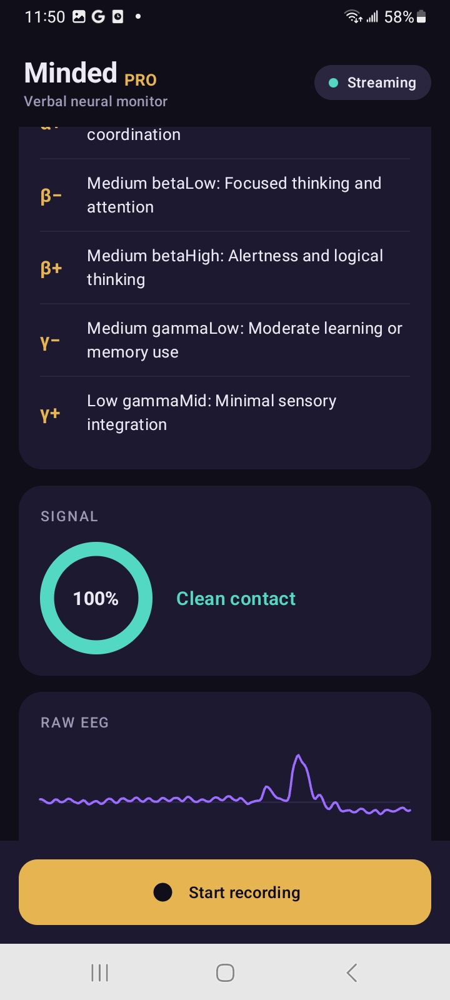
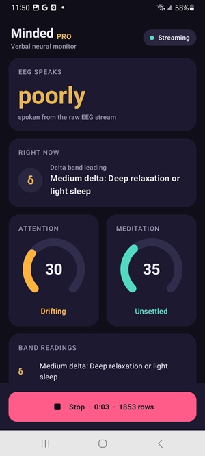

# Minded Pro

**Minded Pro** is an Android app that connects to a NeuroSky **ThinkGear**
Bluetooth EEG headset and turns its neural data into **plain language**. Instead
of raw numbers, the raw EEG stream is shown as a single word, each frequency
band is shown as a state sentence, and attention / meditation each get a
one-word verdict.

It is written in **Kotlin** with a **Jetpack Compose** Material 3 UI. Its
`applicationId` is `com.minded.pro` and its launcher label is *Minded Pro*.

---

## How it works, end to end

```
ThinkGear headset ──Bluetooth SPP──► HeadsetLink ──bytes──► ThinkGearDecoder
                                                                   │
                                                          NeuralEvent stream
                                                                   │
                                                            MonitorViewModel
                                              (numbers ─► words via interpret/)
                                                                   │
                                                            MonitorUiState
                                                                   │
                                                            MonitorScreen (Compose)
```

1. **`HeadsetLink`** owns a self-healing Bluetooth Classic (SPP / RFCOMM) link.
   Once started it scans the *bonded* (already-paired) devices, opens an RFCOMM
   socket to the first one that accepts, and reads bytes off the socket. If the
   socket drops it waits ~2 s and retries. Connection status is exposed as a
   `HeadsetState` enum (`Idle`, `BluetoothOff`, `PermissionNeeded`,
   `NoHeadsetPaired`, `Searching`, `NotReachable`, `Streaming`, `Dropped`).

2. **`ThinkGearDecoder`** is a byte-by-byte state machine that parses the
   ThinkGear serial wire format:

   ```
   0xAA 0xAA  <length>  <payload…>  <checksum>
   ```

   The payload is a list of rows (code byte, then a length + value bytes when
   the code is `>= 0x80`). The checksum is the low byte of the bit-inverted sum
   of the payload. Recognised codes become `NeuralEvent`s:

   | Code | Event | Meaning |
   |------|-------|---------|
   | `0x02` | `SignalQuality(noise)` | 0 = clean contact, 200 = off-head |
   | `0x04` | `Attention(level)` | focus index, 0..100 |
   | `0x05` | `Meditation(level)` | calm index, 0..100 |
   | `0x16` | `Blink(strength)` | blink strength, 1..255 |
   | `0x80` | `RawSample(amplitude)` | one signed 16-bit raw EEG sample (~512 Hz) |
   | `0x83` | `Spectrum(bands)` | eight band powers (once per second) |

3. **`MonitorViewModel`** collects both `HeadsetLink.state` and
   `HeadsetLink.events` and folds them into a single immutable `MonitorUiState`.
   As numbers arrive it runs them through the interpretation layer to produce
   words. Raw samples arrive ~512×/s, so the waveform and word are published to
   the UI only every 6th sample to keep recomposition cheap; every sample is
   still written to an active recording.

4. **`MonitorScreen`** renders one scrollable Compose dashboard from that state.

---

## Turning numbers into words

### Raw EEG → a single word (`RawLexicon`)

The raw amplitude is mapped to a word by looking it up in the bundled
**`app/src/main/assets/eeg_map2.csv`** table. Each row is `amplitude,word,index`
(e.g. `-3000,whats,1`). The file loaded here has **6,000 rows covering
amplitudes −3000..2999**. Any sample outside that window is folded back into
range with a modulo, so the same amplitude always yields the same word:

```
index = ((amplitude - minAmplitude) mod size + size) mod size
```

The table is parsed once at startup (`RawLexicon.load`) from app assets.

### Band powers → state sentences (`BandInterpreter`)

Each of the eight bands is classified into **three tiers — Low, Medium, High**
— using per-band `[low, high]` ceilings:

- `value <= low`  → **Low**
- `value <= high` → **Medium**
- otherwise       → **High**

Each tier maps to a fixed sentence (the comments in the code attribute these to
a `describe_wave` reference script). For example, Delta uses ceilings
`[100000, 5000000]` and the sentences *"Low delta: Mentally alert or stressed"*
/ *"Medium delta: Deep relaxation or light sleep"* / *"High delta: Deep sleep or
unconsciousness"*. The band with the highest power relative to its Medium
ceiling (`intensity`) becomes the headline "Right now" reading.

The eight bands, in the headset's reporting order: δ Delta, θ Theta, α− Low
Alpha, α+ High Alpha, β− Low Beta, β+ High Beta, γ− Low Gamma, γ+ Mid Gamma.

### Attention / Meditation → one word

`focusWord(level)` maps the 0..100 attention index to *Unfocused / Drifting /
Engaged / Focused / Locked in*; `calmWord(level)` maps meditation to *Restless /
Unsettled / Easing / Calm / Deeply calm*.

---

## The screen

`MonitorScreen` shows, top to bottom:

- **EEG speaks** — the raw stream rendered as one large gold word.
- **Right now** — the dominant band, named and described.
- **Attention & Meditation** — two arc gauges, each with its one-word verdict.
- **Band readings** — all eight bands as symbol + state sentence.
- **Signal** — a contact-quality ring (`contactPercent = 100 − noise/2`) with a
  verdict (*Clean contact* / *Adjust the headband* / *No skin contact*).
- **Raw EEG** — a live waveform of the most recent ~240 samples.
- **Recording bar** (pinned at the bottom) — start/stop capture and share.

Before any of this is shown, `MainActivity` gates on the runtime
`BLUETOOTH_CONNECT` permission (Android 12+); until it is granted a
`PermissionPrompt` is displayed and `viewModel.onConnectAllowed()` is not
called.

---

## Recording & sharing

Tapping **Start recording** opens a timestamped CSV under the app's external
files dir (`.../files/sessions/minded-pro-<yyyyMMdd-HHmmss>.csv`) via
`SessionRecorder`. Every raw sample (all ~512/s, not just the published ones)
becomes a row. Tapping **Stop** flushes and closes the file; a **Share** button
then hands it to any app through the system share sheet using a `FileProvider`
content URI (`SessionSharing`), so no storage permission is needed.

The CSV columns written by the code are **verbal, not numeric** — the raw
amplitude and band powers are stored only as their words/sentences:

```
timestamp_ms, signal_noise, raw_word, attention, meditation, blink,
delta_state, theta_state, low_alpha_state, high_alpha_state,
low_beta_state, high_beta_state, low_gamma_state, mid_gamma_state
```

---

## Project layout

```
app/src/main/java/com/minded/pro/
  MainActivity.kt              Compose host; gates on the Bluetooth permission
  headset/
    NeuralEvent.kt             sealed event model + BandPowers + µV conversion
    ThinkGearDecoder.kt        ThinkGear packet state machine
    HeadsetLink.kt             self-healing Bluetooth SPP link + HeadsetState
  interpret/
    BandInterpreter.kt         band power -> tier + state sentence; focus/calm words
    RawLexicon.kt              raw amplitude -> word (eeg_map2.csv lookup)
  session/
    SessionRecorder.kt         streaming CSV writer
    SessionSharing.kt          FileProvider-backed share intent
  ui/
    MonitorViewModel.kt        folds NeuralEvents into MonitorUiState
    MonitorScreen.kt           the single Compose screen + permission prompt
    components/                gauges + waveform chart
    theme/Theme.kt             dark Material 3 palette with the gold Pro accent
app/src/main/assets/eeg_map2.csv   amplitude→word lookup table (6000 rows)
```

`NeuralEvent.rawToMicrovolts(amplitude)` is provided for converting a raw sample
to microvolts (1.8 V reference, 12-bit ADC, gain 2000), though the UI renders
the raw stream as a word and a waveform rather than in µV.

---

## Building

- **Gradle 9.4+** / **Android Studio Ladybug (2024.2)+**, **Android SDK 35**,
  **JDK 17**.
- `namespace` / `applicationId` = `com.minded.pro`, `minSdk 26`, `targetSdk 35`,
  `versionName 1.0`.

```
gradle wrapper          # once, if the wrapper jar is not present
./gradlew assembleDebug
```

Key dependencies: Jetpack Compose (BOM 2024.12.01) with Material 3 and extended
icons, Lifecycle/ViewModel-Compose, and kotlinx-coroutines.

### Permissions

- `BLUETOOTH_CONNECT` — requested at runtime (Android 12+).
- Legacy `BLUETOOTH` / `BLUETOOTH_ADMIN` — declared with `maxSdkVersion="30"`.
- `android.hardware.bluetooth` feature is required. No storage permission.

---

## Pairing

ThinkGear headsets use **Bluetooth Classic**. Pair the headset in Android's
system Bluetooth settings **before** opening Minded Pro. The app then connects on
its own to the first reachable bonded device and retries about every two seconds
while disconnected.
